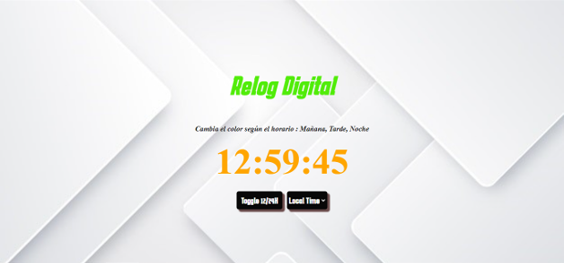

# Reloj Digital Proyecto

## Descripción
Este proyecto consiste en un reloj digital desarrollado con [Html, Css y JavaScript]. Proporciona una interfaz elegante y funcional para mostrar la hora actual de manera digital. Es ideal para su integración en aplicaciones web o proyectos que requieran la visualización precisa del tiempo.

## Características
- Visualización clara y fácil de leer de la hora actual.

## Uso
1. Abre el archivo `index.html` en tu navegador.

## Enlaces
- [Demo del Contador](https://proyecto-contador-gv.netlify.app/)
- [Repositorio del Proyecto](https://github.com/Giancarlos1024/ProyectoContador)

## Contacto
- Si tienes preguntas o sugerencias, no dudes en contactarme en
***[giancarlosvlsqz@gmail.com]*** o [Youtube : https://www.youtube.com/channel/UCj83gBLcRUpUHe-EXNFAvGw ]
